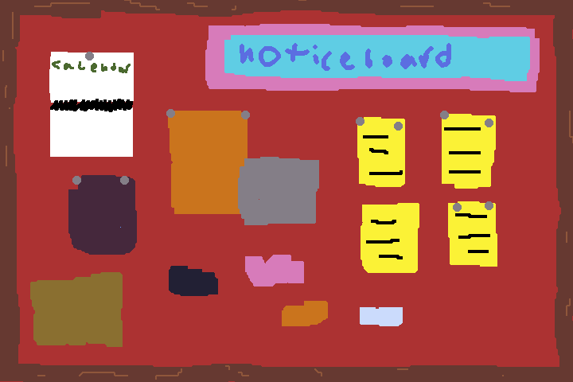
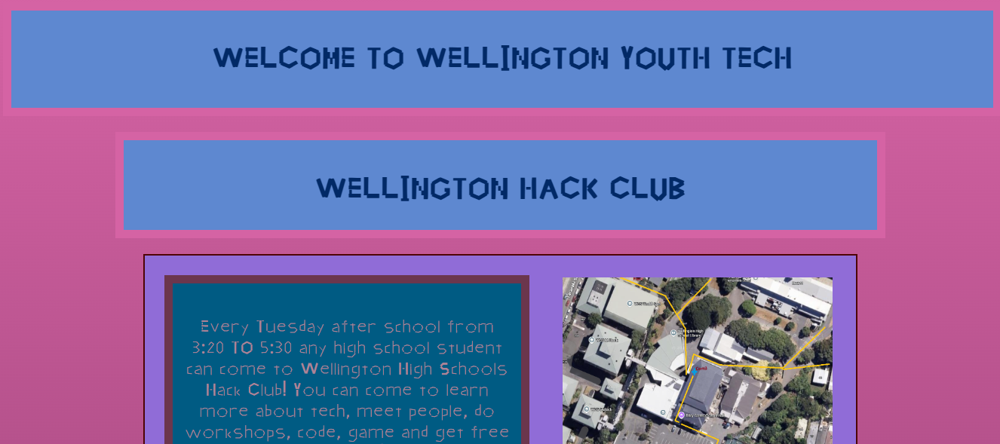
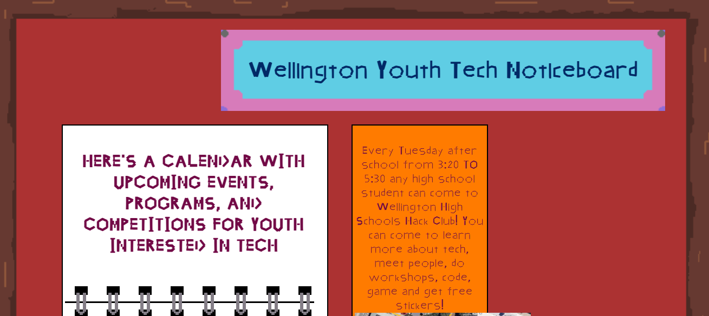

# Wellington Youth Tech Website

My concept

## Background

My aim for this website was to make something that looked like a noticeboard for young people in Wellington NZ interested in tech.
I was inspired by mixed media art edits to Olivia Rodrigos new album "You seem pretty sad for a girl so in love" and someones portfolio which was just a collage which I saw one time (sadly I could not find). I started with something very far off as I was just starting so I had no idea how to turn these basic concepts into an actual noticeboard. 
It turned out ok for version 1 of the website but it was definitely not what I wanted

So I persevered and started again from scratch. I utilized the assets and learnings from v1 to create a very cool version 2

The calendar which is created from a white box background, a linked google calendar, some text, and some pixel art I made that makes it look as if it really is a calendar hanging on a noticeboard which to me is so sick. 

## Contribution

I will be sharing this with my club and peers and getting their advice but if anyone wants to add a link to the notes posted or events they think are relevant contact me on the email on the website!

## AI

I used ai to figure how to place an image in line with the text in a textbox in v1 but after that I didnt use Ai because I wanted to grind it out myself so I actually learn how to make a website.